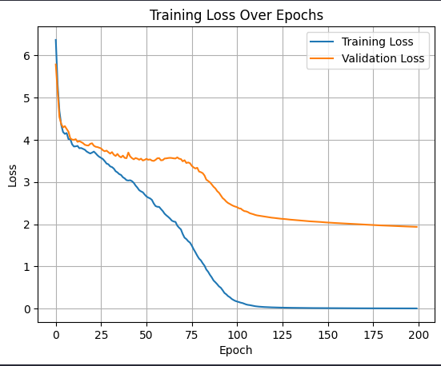
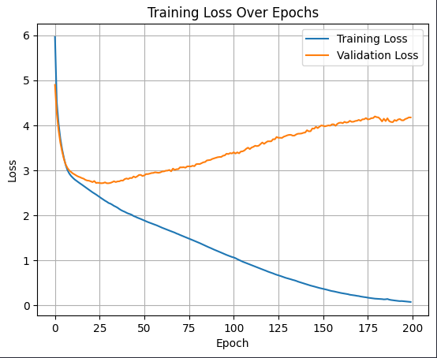
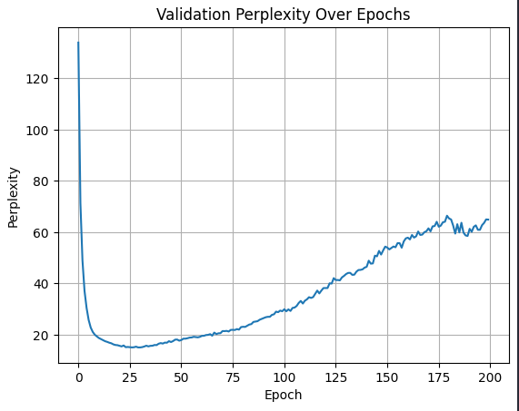

# Shakespeare Generator

**YouTube Video**: [Shakespeare Sonnet Generator](https://youtu.be/4Z-K0UAuK3M)

## **1. Introdução**

Nos últimos anos, a geração automática de sonetos shakespeareanos gerou interesse e trabalhos relevantes de NLP, com modelos de linguagem que se propunham a reproduzir vocabulário e estilo dessas poesias. No entanto, a maioria desses modelos (como Lau et al. 2018, Benhardt et al. 2018, mais descritos na próxima seção) utiliza de arquiteturas complexas e grande volume de dados. Seria possível criar um modelo mais leve, utilizando também self-attention, treinado apenas na obra de sonetos de Shakespeare, e ainda assim obter resultados satisfatórios? Alterar o dataset com tokens personalizados pode ajudar no seu desempenho? Por fim, concatenar a saída de um modelo com outros recursos para polir a saída final?

Portanto, o objetivo deste projeto é:

1. Construir um modelo “lightweight” com o objetivo de gerar sonetos no estilo Shakespeare.
2. Explorar mecanismos para **rima**, testando tags personalizadas, como `<LINE>` e `<rhyme_X>`, na tentativa de introduzir informações semânticas sobre esquema de rima.
3. "Polir" a saída do melhor modelo, por exemplo usando uma LLM, removendo duplicações, corrigindo quebras de linha e pequenos erros ortográficos, sem alterar o sentido original do soneto.

Este relatório inclui:

* Breve análise de outros trabalhos;
* Arquitetura do modelo e escolhas de tokenização (metodologia);
* Treinamento/avaliação e métricas;
* Resultados;
* Discussão.

---

## **2. Trabalhos Anteriores**

Nas últimas décadas, diversos projetos se proporam a criar modelos de linguagem que conseguissem gerar sonetos shakespearianos. Esse processo envolve dois aspectos principais: entender/reproduzir o ingês arcaico e seguir padrões de rima clássicos de soneto (ex: iâmbico). Um resumo dos trabalhos com suas fontes se encontra abaixo.

1. **Lau et al. (2018) “Deep‐speare”**

   * **Arquitetura**: Modelo LSTM de múltiplas camadas com atenção, treinado em um corpus de sonetos completos (Project Gutenberg).
   * **Métricas**:

     * Reportaram perplexity ≈ 80 no conjunto de teste.
     * Stress-accuracy (pentameter model das rimas/estrutura): ≈ 0.74.
   * **Contribuição**: Introduziram técnicas que capturam/preservam métrica e rima, mas geração completa de poemas ainda não performa bem.
   * **Fonte**: https://arxiv.org/pdf/1807.03491v1

2. **Benhardt et al. (2018) “Shall I Compare Thee to a Machine-Written Sonnet? An Approach to Algorithmic Sonnet Generation**

   * **Arquitetura**: utiliza RNN que constroi as linhas de trás para frente a partir da palavra de rima, e GloVe embeddings com cosine similarity para encontrar as palavras inicciais a partir do prompt do usuário. treinado em dados de textos diversos (*Endymion by John Keats, collected works of Walt Whitman, and the Hunger Games trilogy by Suzanne Collin*).
   * **Métricas**:

     * Não utiliza métricas numéricas, apenas mostra exemplos das gerações de poema. 
   * **Contribuição**: Modelo que capturam/preserva métrica e rima, incluindo pontuações em lugares corretos e restrições de discurso (usando PoS tags).
   * **Fonte**: https://ar5iv.labs.arxiv.org/html/1811.05067

Outros trabalhos/blog posts considerados:

* [Generating Poetry with RNN](https://sballas8.github.io/2015/08/11/Poet-RNN.html)

**Objetivos e Métricas**:

* Diferente dos outros trabalhos, usar um modelo com menos camadas e hidden‐size reduzido e analisar o quanto conseguimos reproduzir de geração de sonetos.
* Inserir tokens `<LINE>` e `<rhyme_X>` e analisar se os resultados melhoram.
* Com o melhor modelo, testar uma etapa de pós‐processamento com LLM para polir a saída e melhorar os resultados.

*Métricas*

Para essa tarefa, de acordo com os trabalhos anteriores, 3 métricas foram escolhidas para medir a qualidade do modelo na tarefa de geração:

1. Erro: minimizar a loss (comparando treino e validação). Usando cross entropy, o objetivo é bater uma loss **menor do que 2.0**  

2. Perplexidade: a perplexidade (ppl) é definida a exponencial da média da cross‐entropy por token. Uma perplexidade baixa indica que o modelo atribui maior probabilidade ao texto real de Shakespeare quando testado na geração. O objetivo é alcançar uma perplexidade comparável a 80% do encontrado em outros trabalhos, ou seja, pelo menos 100 (ou menos).

3. BLEU (Bilingual Evaluation Understudy):

O BLEU avalia a sobreposição de n-gramas entre as hipóteses geradas e as referências “verdadeiras”. No nosso caso, a hipótese é a parte de continuação gerada pelo modelo após as $N$ primeiras palavras do soneto, e cada referência é o texto original que segue esse prompt.
        
O valor do BLEU varia de 0 (nenhuma sobreposição de n-gramas) a 100 (hipótese idêntica à referência). Baseado [nessa](https://klu.ai/glossary/bleu-score), [essa](https://www.digitalocean.com/community/tutorials/automated-metrics-for-evaluating-generated-text#bleu) e [essa](https://www.geeksforgeeks.org/understanding-bleu-and-rouge-score-for-nlp-evaluation/) sobre BLEU, o objetivo escolhido foi de pelo menos 70, ou seja 70% de sobreposição.

Referências completas de artigos:

* Lau, J.H., Caverlee, J., & Baldwin, T. (2018). Deep-speare: A joint neural model of poetic language, meter and rhyme. *ACL*.
* Benhardt, T., Szymanski, M., & Hirst, G. (2018). Shall I compare thee or not? A transformer approach to Shakespearean text generation. *EMNLP*.

---

## **3. Metodologia**

### 3.1 Pré-processamento

A primeira etapa da metodologia é obter e pré-processar o dataset para o modelo. Todos os detalhes podem ser encontrados [nesse notebook](./1.tokenizer.ipynb). Os seguintes passos foram seguidos:

1. **Dataset**: foi utilizado esse [dataset do HuggingFace](https://huggingface.co/datasets/Lambent/shakespeare_sonnets_diffused/tree/main), com a obra de sonetos de Shakespeare completa. A ideia é tentar treinar um modelo apenas com as obras de Shakespeare, diferente dos outros trabalhos, que usam obras de outros autores. O dataset contém ~450 sonetos, seguindo o esquema iambic pentameter clássico de seus poemas.

2. **Tokenizer**

Foi feito com `sentencepiece` e `vocab_size=4000` (valor escolhido para evitar tokens muito pequenos pas também permtir quebra de palavras). 

Na primeira versão, sem rimas, os tokens especiais são `<PAD>`(para padding) e `<LINE>` (para quebra de linha). O `max_len=256` para padding foi escolhido por ser a potência de 2 mais próxima do tamanho do maior soneto (277).

Já na versão com tags de rima, as tags `<rhyme_X>` foram adicionadas para cada verso de acordo com a sua rima no esquema iâmbico. Nesse caso, como o final de cada frase é ainda mais importante, foi decidido usar `max_len` como o próprio 277, para que nenhum soneto perdesse palavras e, consequentemente, prejudicasse rimas.


3. **Tensores**

`X` e `y` com janelas deslizantes (sliding window) para predição do próximo token. Assim, o último elemento de `y` é sempre `pad_id`.

Os tensores são salvos na pasta `/data` para serem usados posteriormente.

### 3.2 Modelo

Para ambos os experimentos, foi usado um modelo "lightweight" RNN com camadas de embedding (sem uso de modelo pré-treinado para isso) e atenção para lidar com as sequências de tokens com melhor desempenho.

O código fonte do modelo pode ser encontrado em `model.py`. Algumas de suas características são:


* Embedding size = 256
* Número de heads = 4
* Número de camadas Transformer = 4
* Feedforward hidden = 1024
* Dropout = 0.1
* Vocabulário = 4000 (incluindo `<PAD>`, `<LINE>` para ambos os experimentos e `<rhyme_X>`)
* `CrossEntropyLoss` foi utilizada como a função de perda, inspirado em outros problemas de geração de texto.
* No experimento de rima, para aumentar a valorização `<LINE>` e `<rhyme_X>`, foi adicionado peso = 5.0 para o erro desses tokens.

---

## 4. **Training e Testing**

### 4.1 Divisão de Dados

* **Treino** = 80%
* **Validação** = 10%
* **Teste** = 10%
* Tamanho de batch = 16 (para evitar que acabasse a memória da placa de vídeo, o processamento de cada epoch é em batches)

### 4.2 Hiperparâmetros de Treino

* Otimizador: `AdamW(lr=5e-4, weight_decay=1e-5)`
* Épocas máximas = 200 (**early stopping** baseado em `val_loss` foi usado em alguns treinamentos iniciais para entender quando o modelo parava de melhorar.)
* `train_one_epoch` realiza o treino completo de uma epoch do modelo, enquanto `train_one_epoch_with_criterion` faz a mesma tarefa, mas recebendo uma função de critério que pode ter pesos diferentes de erro para certos tokens (usado para as quebras de linha e rimas no experimento 2). 

Detalhes de implementação de todas as funções auxiliares podem ser encontradas em `utils.py`.

### 4.3 Métricas

1. **Loss (CrossEntropy)**

2. **Perplexity**

   * `val_ppl = exp(val_loss)` a cada época.

3. **BLEU (Corpus‐level)**

   * Para geração de teste, foi extraído um "prompt" de tamanho X (ex.: 10 tokens iniciais de cada soneto completo) e mandamos gerar até `X+60` tokens.
   * Comparação: `generated[i]` vs. `continuation_real[i]` para todo i no conjunto de teste.

---

## 5. Resultados

Detalhes dos resultados dos modelos podem ser encontrados em `2.transformers.ipynb`.

### 5.1 Curvas de Loss e Perplexity

*OBS: todos os modelos foram treinados por 200 epochs pois foi a quantidade que demonstrou convergência das losses*

#### Experimento 1 - Sem rimas e line break

Loss:



Perplexity Validação:


Conjunto de teste após treinamento:

      loss: 1.8118 | perplexity: 6.12

Como podemos ver nos gráficos acima, o modelo parace aprender com sucesso a prever os próximos tokens dos sonetos, com a loss tanto do treino quanto da validação diminiundo. Enquanto a loss de treino alcançou valores que se aproximaram de 0, a do conjunto de validação estabilizou logo abaixo de 2 após 200 epochs.

Em relação a perplexity por token de validação, ela também tendeu a 0, mostrando que o modelo "se surpreende pouco" com as suas predições, o que é um indicativo de estabilidade nas predições.

Por fim, o conjunto de teste mostra que o modelo ainda tem uma perplexidade um pouco maior com certos sonetos, mas conseguiu manter a loss estável.

#### Experimento 2 - Com tags de rimas

Loss:



Perplexity Validação:



Conjunto de teste após treinamento:

      Conjunto de teste — loss: 4.2952 | perplexity: 73.35

Diferente do primeiro experimento, o segundo teve resultados longe dos esperados. A loss dos modelos começou caindo, mas rapidamente a loss de validação passou a aumentar, enquanto a de treino caía. Essa é uma característica clara de overfitting, com o modelo indo exepcionalmente bem no treinamento e falhando completamente em novos exemplos, sem conseguir generalizar.

Uma possível explicação para o overfitting está relacionada justamente aos tokens novos, com maior peso. Seu objetivo inicial era mostrar ao modelo que ele deveria "dar atenção" especialmente às quebras de linha e rimas, mas, isso pode ter causado que o modelo focasse apenas em aprender exatamente os padrões daqueles sonetos de treinamento para minimzar o erro, nesses tokens principalmente, tirando sua capacidade de generalizar.

A perplexidade da validação e o desempennho nos testes reafirmam a hipótese, com métricas muito inferiores ao experimento 1.

Um possível passo futuro poderia incluir testar tokens diferentes para continuar testando essa estratégia para rimas e quebras de linha.

### 5.2 BLEU

A métrica BLEU score foi empregada após o treinamento dos modelos, testando sua capacidade de gerar os sonetos de teste. Os resultados estão sumarizados abaixo:

| **Variante do Modelo**         | **Test Perplexity** | **Test BLEU (corpus)** |
| ------------------------------ | ------------------ | ---------------------- 
| 1) Transformer (baseline)      | 6.12               | 71.83                   |
| 2) + `<LINE>` e `<rhyme_X>`    | 73.35               | 65.83                   |

Apesar de a diferença entre as perplexidades serem altas, o BLEU score entre os dois modelos não foi tão diferente. Para o modelo 2, isso demonstra que ele teve certa capacidade de generalização para entender o conjunto de teste, mas quando em uma geração completa, seus textos rapidamente se perdiam completamente.

Focando no modelo 1, o BLEU score de 71.83 demonstra que o modelo conseguiu aprender a prever sonetos com boa qualidade com o contexto de tokens anteriores, apesar de não conseguir manter a métrica iâmbica e rimas corretas em contexto de geração livre. 

---

## **6. Polimento com LLM**

Na época de LLMs que vivemos hoje, muitas pessoas diria que poderíamos apenas pedir para que uma LLM, como o Gemini ou o ChatGPT, gerasse um poema shakespeariano; mas usar LLMs não nos permite ter clareza e transparência do processo de geração, além de que ele provavelmente nunca retornaria a mesma saída para a mesma entrada em duas chamadas diferentes. Essas características normalmente deveriam ser suficientes para nunca delegarmos tarefas extensas e completas a simplesmente um modelo como esse.

No entanto, isso não siginifica que LLMs não podem auxiliar. LLMs são excelentes em duas tarefas que são essenciais para a nossa geração e estão sendo um grande problema: **encontrar padrões e correção de erros**. Mesmo o melhor modelo encontrado na seção anterior não foi capaz de aprender a realizar quebras de linha e rimas com precisão. Ademais, o modelo acabava gerando alguns tokens sem sentido ou duplicados em algumas das gerações que, caso fossem limpos, melhorariam a clareza do texto.

Portanto, dada a grande habilidade de LLMs em justamente realizar esse tipo de tarefa de "polimento", esse trabalho propõe a implementar, como um pós-processamento da saída do modelo, um LLM que peça para lidar com:

* Palavras duplicadas
* Frases repetitivas
* Quebra de linhas
* Palavras levemento escritar erradas  
* Rimas

Tudo sem alterar as palavras e o sentido original do soneto gerado. Para isso, o seguinte prompt foi utilizado:

```py
f"""
You are an expert and a teacher in Shakespearing sonnets. Your goal is to take your student's sonnet and help him polish it. You need to pay attention to:
* Duplicate words
* Repetitive phrases
* Line breaks
* Slight mispells
* Words that were clearly stuck together

You are NOT allowed to change the student's words or their meaning, that will make him sad!

Your output should be the new sonnet. No explanations, no anything more or less.

Here is the student's sonnet:
{generated_sonnet}
"""
```

Os detalhes de implementação podem ser encontrados em `3.llm.ipynb`.

### Testando

Com o token inicial "Thy", o soneto gerado pelo modelo foi:

"Thy both most ensnared our honor our honor honor friendship respect lies read lies in our being- our love forever lives lies our thee to the honor witht th love stoneive learn to discern core within through life by labory itst phrases in its sacred She ourt
 Yet death to plague he belong me reside, So simple's deceptive dost black lies, Over granted scholars by its amongmp find believ gaze find its decreeyis skillownys worth outshine free. 
 Ens fail peace no more our destiny entwined in ourselves inv haless repent, ourselves concealed within our age no stage lead; 
 Seducing our artist in this ground extreme; 
 Speak restmeri solace glare, our secret, with its profan bloom that flourishes both grief maintain thus, better tainteds vast archive shall kindly Nature'll needs're fashion has madey expression to move by tears and moonlit air."

Como é possível ver, existiram quebras de linha. No entanto, ainda existem muitos erros, falta de rimas e palavras que duplicam ou não encaixam, o que prejudica o sentido para um leitor.

Após o polimento, foi obtido:

""
Thy ensnared honor, friendship, respect, lies read
In our being; our love forever lives, lies
In thee; the honor, love, stone I've learned to discern,
Core within, through life's labor, its phrases, sacred.

Yet death may plague; he belongs, resides in me.
So simple's deceptive, black lies,
Over-granted scholars find, believe, gaze, find
Its decree; its skill, own worth outshines free.

Ensnare peace; no more our destiny entwined,
In ourselves, unless repent; ourselves concealed
Within our age, no stage leads;
Seducing our art in this extreme ground.

Speak, rest; mere solace glares; our secret,
With its profane bloom, flourishes; both grief
Maintained, vast archive shall kindly nature's fashion
Express; to move by tears and moonlit air.
"""

Como é possível, o LLM realizou um ótimo trabalho em corrigir, principalmente:

* Palavras duplicadas  
* Quebras de linha  
* Erros de palavras  
* Palavras sem sentido em frase

O que demonstra uma melhora significativa na qualidade da saída, mas sem entregar a tarefa completamente ao Gemini (o que tiraria a explicabilidade e o controle completo do desenvolvedor), mas o utilizando com um assistente para polir a saída do modelo gerador.

No entanto, é importante destacar que rimas ainda foram um problema: o LLM não conseguiu ajustar esse quesito, muito provavelmente pois seria necessário alterar muitas palavras, o que fugiria da limitação do prompt, que pedia para não alterar substancialmente o soneto original.

O terceiro experimento demonstra o potencial de LLMs para polimento de saída de um modelo especializado, ao invés de substituí-lo. Um próximo passo futuro poderia ser continuar testando novos prompts com pedidos variados, e tentar calcular novas métricas para a saída do LLM, o que não entrou no escopo desse projeto.

---

## 7. Resultados Qualitativos

A seguir, mostramos **1 exemplo** de soneto completo gerados pelo sistema **antes** e **depois** da etapa de “polimento”. Mais exemplos podem ser encontrados e gerados no notebook `3.llm.ipynb`.

**Prompt** (as 8 primeiras palavras de um soneto real de teste): 

"Earth has not anything to show more fair:"

**Geração Bruta**:

"Earth has not anything to show more fair: flattery find respect for  to multitudellinting disdain 
 Bright and beauty, yet green lost Unfair to common to grow to the tales  too, remain, clear by errors isolationlain. 
 veins Sings zenithing, fairly the chains guise, defy shatterly speak provoke for my rem,aning eclipses increase by reprieve, unfa Time run thy devotion increase, has captures to a shadow graced by Time's fades away free. blely winter cannot straying rotlit grace one thou shalt Death wouldfere falls to grayears would with ease. 
 Feed. looms death to Reviv eternal pride, extremeived toose it pleasess accord? ve lost where life may cease. 
 Who granted have sworn whispers both to find dark ve'tis cause creature."

**Geração Polida (após LLM)**

"Earth has not anything to show more fair:
Flattery finds respect for multitudinous disdain.
Bright beauty, yet green lost, unfair, common to grow.
The tales remain, clear by errors, isolation lain.

Veins sing zenithing, fairly the chains guise.
Defy shatteringly; speak, provoke my remaining eclipses.
Increase by reprieve, unfaded time runs.
Thy devotion increases; captures a shadow graced by time's fades away free.

Bleak winter cannot stray; rotting grace, one thou shalt.
Death would prefer falls to gray years with ease.
Feed. Death looms to revive eternal pride, extreme.
It pleases; accords? We've lost where life may cease.

Who granted have sworn whispers both to find.
Dark veils; it is cause; creature."

É possível perceber que o polimento melhorou a qualidade do soneto, principalmente em relação a quebra de linhas, palavras duplicadas e palavras sem sentido. No entanto, ainda existem problemas de rimas e métrica iâmbica, que não foram corrigidos pelo LLM, como já comentado. Além disso, não significa que os sonetos seguem um tema constante ou possuem sentido completo, o que mostra ainda mais a dificuldade de geração do zero.

---


## 8. Conclusão

Neste projeto, foram realizados 2 experimentos com o objetivo de criar um **modelo lightweight** para a geração de sonetos em estilo Shakespeare, treinados apenas com sua obra, visando manter a qualidade de quebras de linha e rimas. Além disso, LLM foi usada como um auxiliar de polimento da saída do modelo, lidando com palavras duplicadas, quebra de linhas, entre outras características.

Com os resultados alcançados, podemos ter conclusões interessantes:

1. É possível criar um **modelo leve** capaz de atingir as métricas que estavam como objetivo. No entanto, a geração ainda se mostra um problema.

Apesar de atingir as métricas esperadas na geração dos sonetos dos conjuntos de validação e teste, o modelo do experimento 1 ainda tem dificuldades em geração de texto do zero (generalização). 

Esse resultado faz sentido em relação aos trabalhos anteriores, que também citaram a dificuldade no aprendizado dessas gerações. Além disso, isso mostra que, as métricas do modelo leve serem equiparáveis aos trabalhos relacionados não significa que o modelo é necessáriamente tão bom quanto ou nem melhor, mas que a tarefa de aprender a prever os sonetos com contexto dos tokens anteriores corretos é muito mais simples que gerar um soneto do zero.

2. Um simples **sinalizador de rima** no vocabulário nem sempre traz ganhos diretos.

Pelo contrário, o uso dos sinalizadores com pesos elevados na loss causou overfitting do modelo e resultados de geração muito inferiores, o que pode estar relacionado a o modelo focar completamente em apenas acertar esses tokens no treino e memorizasse padrões locais, sem generalizar, resultando em *val loss* pior e *perplexity* maior.

3. A geração de sonetos ainda é um problema complexo, com o modelo tendo dificuldades em manter a métrica iâmbica e rimas corretas, com ou sem tokens personalizados.

4. Para melhorar as lacunas do modelo treinado, o uso de um **LLM** para polir o soneto se mostrou uma prática com potencial para aumentaa a qualidade final, auxiliando o custo computacional restrito do modelo. 

5. Isso não significa que um LLM deva substituir o próprio modelo. A técnica demonstrou potencial para testes futuros, como o uso de prompts variados e outras métricas além de um "eye ball test".


### *Limitações*

* A geração final ainda tem dificuldade em não repetir palavras e manter um tema completamento coerente, o que é um problema semelhante a outros enfrentados na geração dos trabalhos anteriores.

* Métrica iâmbica não funciona. Apesar das tentativas com o próprio modelo e o uso de tokens personalizados, o modelo não conseguiu aprender a manter a métrica iâmbica corretamente, o que é um problema comum em modelos de geração de texto. O LLM polidor, por sua vez, também não conseguiu corrigir esse problema, pois o prompt não permitia alterar muito as palavras e o sentido original do soneto (visando não perder o controle sobre o texto).

* Dependência de um LLM externo (Gemini) para polimento implica custo e latência, tirando um pouco da proposta de simplicidade, apesar de ajudar a melhorar a qualidade final do modelo leve.

* Apesar de o resultado polido ser muito superior, isso não significa que os sonetos gerados tenham um tema coerente ou façam sentido completo. Eles são estéticamente agradáveis, mas ainda é preciso mais testes para melhorar a qualidade semântica dos sonetos.

### Possíveis próximos passos

Apesar dos resultados interessantes, há várias direções que podem ser exploradas para aprimorar o modelo e a geração de sonetos shakespearianos:

* **Aprimorar o modelo**: utilizar outras técnicas descritar pelos trabalhos anteriores.
* **Utilizar partes pré-treinadas**: encontrar modelos de embedding que sejam pré-treinados pode ajudar a aumentar a qualidade do modelo, apesar de diminiur a simplicidade do modelo. Fine-tune pode também ser uma alternativa interessante.
* **Tokens de rima**: para a estratégia de tokens de rima, mais dados com essa estratégia podem ser utilizados para observar se o modelo consegue generalizar melhor sem overfitting.
* **Explorar outros LLMs**: testar outros LLMs com prompts variados para polimento, por exemplo, forçando o LLM a manter a mesma quantidade de linhas em todo poema, algo que às vezes é quebrado em algumas chamadas.
* **Aplicar métricas no LLM**: apesar de não ter sido realizado nesse projeto por quesito tempo e limitação de chamadas de API, testar métricas, como o BLEU score, no LLM ao conjunto de teste durante ou após treinamento pode ajudar a entender melhor a qualidade da saída do LLM e como ele pode ser melhorado.